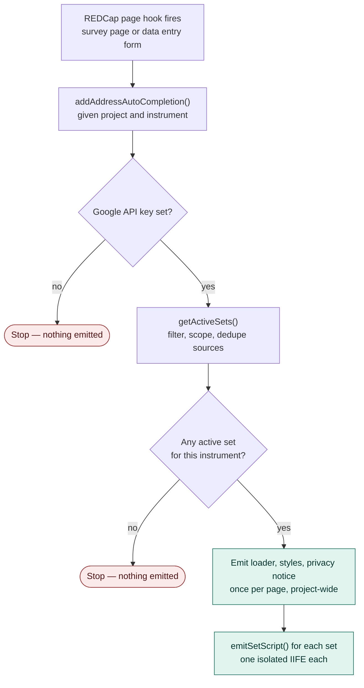
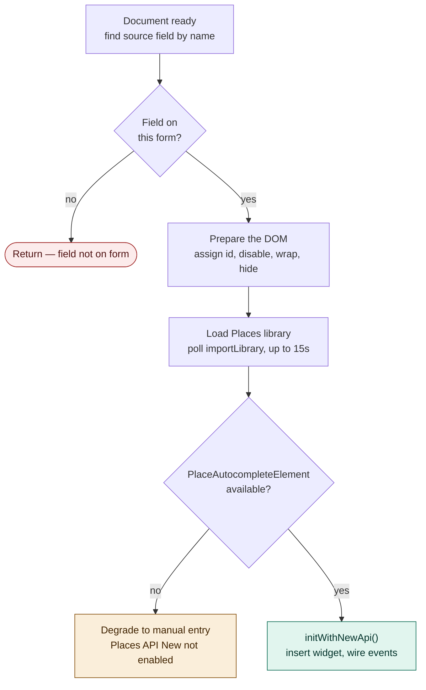
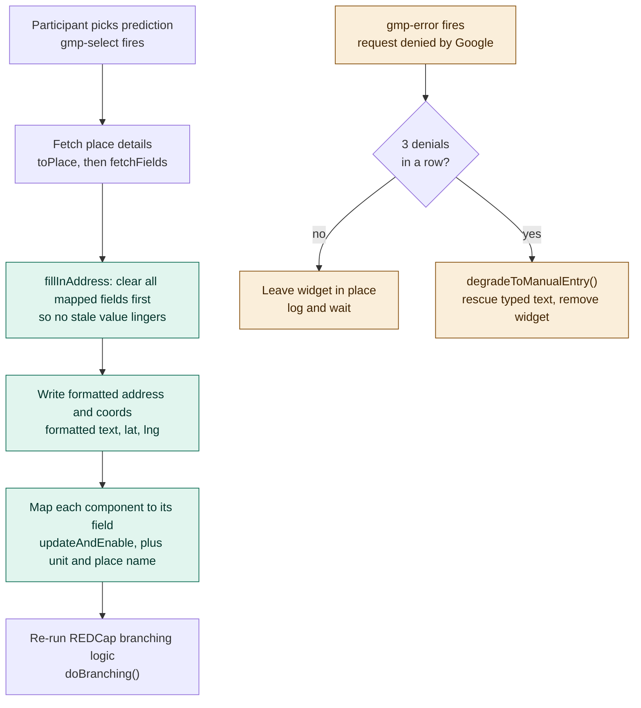

# Execution flow

Reference for how **Google Address Autocomplete** runs, from the REDCap page
render through to a chosen address landing in the mapped fields.

The module runs in two phases that happen at different times and in different
places:

1. **Server-side (PHP)** — runs once when REDCap renders the page. It decides
   which address field sets apply to this instrument and emits a self-contained
   `<script>` for each.
2. **Client-side (JavaScript)** — one isolated IIFE per set, running in the
   participant's browser. It attaches the Google widget to the field and, on
   selection, spreads the address across the mapped REDCap fields.

Almost every step has an exit. A missing field is a clean return; a missing
library or a run of denied requests degrades to plain manual entry. In every
degrade case the previously-disabled destination fields are re-enabled, because
a disabled input is not submitted — skipping that would silently save blanks.

---

## Phase 1 — Server-side render (PHP)

Runs once per page. Bails early if there is no API key or no set that applies to
this instrument. Everything shared — the Google Maps bootstrap loader, the
styles, the privacy notice — is emitted at most **once**, no matter how many
sets qualify.

Key points:

- `getActiveSets()` skips a set (and logs it) rather than fatally erroring, so
  one misconfigured set never costs the participant the other address boxes.
- Two sets cannot share a source field — the later one is skipped. A shared
  *destination* field is a warning, not a skip: the field ends up owned by
  whichever set writes last.
- Each emitted IIFE gets a unique element-id prefix (`googleSearch_<index>_`),
  which is the entire mechanism by which two sets on one page stay out of each
  other's way.

---

## Phase 2 — Client-side initialisation (JavaScript)

When the page loads, each set's script first has to find its field and get the
Google widget onto the form — with a fallback at every point that can fail.

Key points:

- The field is looked up by **name**, and the script returns quietly if it is
  not present — a set may be scoped to an instrument server-side, but this guard
  covers the case where it was not.
- The Places library is loaded by polling for `google.maps.importLibrary`. When
  the module emits its own bootstrap loader this resolves immediately; the poll
  exists for the case where another module supplies the API later.
- A missing `PlaceAutocompleteElement` almost always means the API key does not
  have **Places API (New)** enabled. Rather than leaving a widget that looks
  usable but reports nothing, the script degrades and tells the participant.
- `initWithNewApi()` inserts the widget, shows the privacy notice, applies
  geolocation bias, and wires up the `input`, `gmp-error`, and `gmp-select`
  listeners.

---

## Phase 3 — Selection and fill (JavaScript)

The real work happens when the participant picks a prediction. `gmp-select`
fetches the place details and writes them across the mapped fields. A separate
`gmp-error` path counts denied requests and only tears the widget down after a
short burst, so a momentary blip does not cost autocomplete for the rest of the
form.

Key points:

- `fillInAddress()` **clears every mapped field before writing**, so a component
  absent from the newly-selected place cannot keep the previous address's value.
- Latitude and longitude are written and enabled here. They are the only
  destinations looked up by field **name** rather than by generated id — which
  is exactly why the re-enable used to be missed on them, leaving coordinates
  visible on the form but absent from every saved record.
- Writes go through `updateAndEnable()`, which both sets the value and hands the
  field back to REDCap (a disabled input is never submitted).
- Unit / apartment recovery and the place name run after the main component loop
  so they overwrite what it just wrote.
- The error path counts denials within a rolling window; a chosen prediction
  resets the count, since it proves Google is answering again.

---

## Details not shown in the diagrams

Worth knowing when reading the code, but left off the flows to keep them
readable:

- **Two-list consistency (`AddressComponent`)** — the PHP component-to-field map
  and the JavaScript `componentForm` are both generated from a single enum, so
  the two lists cannot drift out of step (they previously had).
- **Unit recovery (`extractUnitParts` / `recoverUnitFromText`)** — Google often
  omits the *subpremise* for Australian and UK unit addresses, so `3/27 Harris
  St` comes back as street number `27`. When enabled, the unit is parsed from the
  typed text, anchored to the street number Google did return, and prepended as
  `3/27`.
- **Latitude / longitude by name** — deliberately not `AddressComponent` cases;
  they have no `googleSearch_*` id and are resolved by field name in
  `fieldElement()`.
